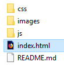
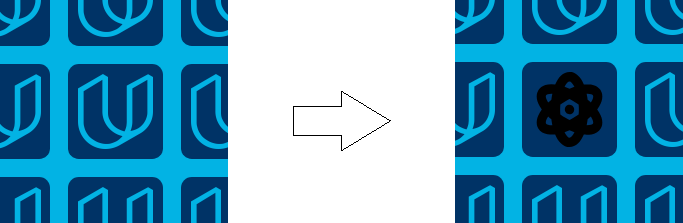

Matching Game
================

In this project, a simple game has been written using html, css and
JavaScript. It has been done for the [Front-End Web Developer Nanodegree](https://eu.udacity.com/course/front-end-web-developer-nanodegree--nd001) in the [Udacity](https://eu.udacity.com/) platform and the board shown at the beginning of the game is the next one:

<p align="center">


</p>

The game board consists of 16 cards arranged in a grid. The deck is made
up of eight different pairs of cards, each with different symbols on one
side. The cards are arranged randomly on the grid with the symbol face
down. The gameplay rules are very simple: flip over two hidden cards at
a time to locate the ones that match.

Each turn:

  - The player flips one card over to reveal its underlying symbol.
  - The player then turns over a second card, trying to find the
    corresponding card with the same symbol.
  - If the cards match, both cards stay flipped over.
  - If the cards do not match, both cards are flipped face down.

The game ends once all cards have been correctly matched.

## How To Play

This app can be used cloning this repository using `git` command:

```
$ git clone https://github.com/AsBaZa/Memory-Game
```

or downloading directly from `https://github.com/AsBaZa/Memory-Game`, clicking on the button:

<p align="center">
 
</p>

Once the repository is downloaded, it can be opened clicking on the `index.html` file:

<p align="center">
 
</p>

The file can be opened with the newest versions of web browsers such as [Firefox](https://www.mozilla.org/), [Google Chrome](https://www.google.com/chrome/), [Opera](https://www.opera.com/), [Safari](https://www.apple.com/safari/) or [Microsoft Edge](https://www.microsoft.com/windows/microsoft-edge). However, the app is not compatible with older web browsers such as [Internet Explorer](https://www.microsoft.com/download/internet-explorer.aspx).

**Note:** No internet connection is required.

The player must click on the cards to flip them over:

<p align="center">



</p>

Once 2 cards are clicked:

  - If they do not match, both cards are flipped face down with a short
    animation.

<p align="center">


</p>

  - If they match, both cards stay flipped over and will become green.

<p align="center">


</p>

When the game is over, the board will disappear and the final score will
be shown.

<p align="center">


</p>

<p align="center">


</p>

## Final Panel

In the final panel, we will see the time we have spent finishing the
game:

<p align="center">


</p>

The number of clicks during the game:

<p align="center">


</p>

And the number of stars obtained (the number of stars depends on the
time spent finishing the game):

<p align="center">


</p>

In order to restart the game, there are 2 buttons.

  - The **refresh** button.
  - The **Restart** button.

<p align="center">


</p>
